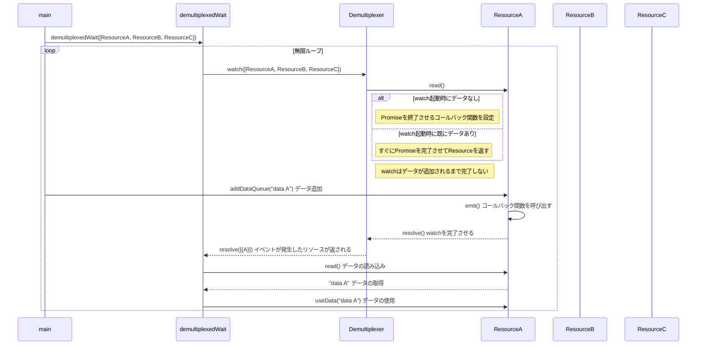
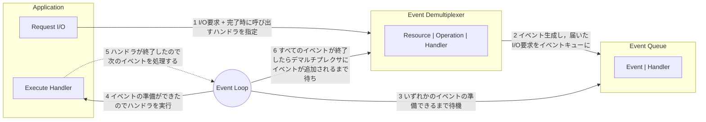

# Non-blocking I/Oについて学ぶ

## Blocking I/Oとは

- I/Oとは: Input/Outputの略で，コンピュータの外部データへの入出力を指す
- I/O処理が終わるまでプログラムの実行が停止することを**Blocking I/O**と呼ぶ

---

## Non Blocking I/Oとは

- I/O処理は時間がかかることが多い。
- 完了を待たずに次の処理を行うことでプログラムの処理効率を向上させることを**Non Blocking I/O**と呼ぶ

### busy-waiting

- データが取得できるまでループを回し，ポーリングする。
- データが取得できる状態になるまで，ループを回し続ける関係上，コンピュータのリソースを無駄に消費する。

#### サンプルコードの動かし方

```shell
cd /app/non_blocking_io/
yarn run bundle
node dist/busy_wait.js
```

1. リソースにデータが追加されるまではリソースの監視を続ける
2. データが追加されると、リソースからデータを取得する

<details>
<summary>実行例（クリックして展開）</summary>

```shell
# 実行例
node dist/busy_wait.js
----- Start watching socketA -----
----- Start watching socketB -----
----- Start watching socketC -----
Waiting for data on socketA)...
Waiting for data on socketB)...
Waiting for data on socketC)...
Waiting for data on socketA)...
Waiting for data on socketB)...
Waiting for data on socketC)...
Adding data to socketA: sample data A
Waiting for data on socketA)...
Waiting for data on socketB)...
Waiting for data on socketC)...
Waiting for data on socketA)...
Waiting for data on socketB)...
Waiting for data on socketC)...
Waiting for data on socketA)...
Waiting for data on socketB)...
Waiting for data on socketC)...
Adding data to socketB: sample data B
Data received on socketA!
use sample data A
Waiting for data on socketB)...
Waiting for data on socketC)...
Waiting for data on socketA)...
Waiting for data on socketB)...
Waiting for data on socketC)...
Waiting for data on socketA)...
Waiting for data on socketB)...
Waiting for data on socketC)...
Waiting for data on socketA)...
Data received on socketB!
use sample data B
Waiting for data on socketC)...
Waiting for data on socketA)...
^C
```

</details>

### synchronus event demultiplexing(イベント多重分離)

- busy-waitingよりもマシンリソース面で効率的
- リソースをまとめて管理し，データが追加等のイベントが発生するまでは待機する。
- イベントが発生した場合にのみ，そのイベントに対応する処理を実行する。

#### サンプルコードについて

概要



```shell
cd /app/non_blocking_io/
yarn run bundle
node dist/synchronus_event_demultiplexing.js
```

<details>
<summary>実行例（クリックして展開）</summary>

```
# 動作説明のため#でコメントを追記しています。実際のコードを実行しても表示されません。
Waiting for events...
Watching resource: socketA
Watching resource: socketB
Watching resource: socketC
# すべてのResourceにコールバック関数を設定し，イベントの発生を待つ

# データ追加イベント発生
Trying to Add data to socketA: sample data A
Trying to Add data to socketB: sample data B

# watch()が完了する
watch() returned with events: 1
Event detected from socketA
Data received on socketA!
use sample data A
Waiting for events...
Watching resource: socketA
Watching resource: socketB
Watching resource: socketC

# データ追加イベント発生(以下略)
watch() returned with events: 1
Event detected from socketB
Data received on socketB!
use sample data B
Waiting for events...
Watching resource: socketA
Watching resource: socketB
Watching resource: socketC
```

</details>

---

## リアクタパターン



